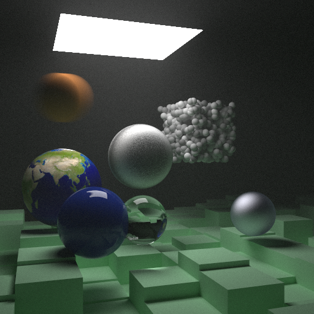

# YARR - Native & Web-based Raytracing

### _Try it here: [Web Demo Link](https://khoifish.github.io/)_



### Pirate speak for ___"Yet Another Rust Raytracer"___

YARR is the result of my personal journey with learning Rust. It also led me to cross-compiling to WebAssembly along the way.

I'm a C/C++ programmer at heart, yet my heart grows ever so fonder for Rust. **Rust gives C++ a run for its money.**

- Based on Peter Shirley's great "Raytracing in One Weekend" book series
- Core implementation in Rust, with some JavaScript glue for the web
- Builds natively for Windows, MacOS, Linux & Web (JavaScript & WebAssembly)
- Multi-threaded via rayon, wasm-bind-rayon, and a manually managed web worker pool
- Tested on iOS/Android via Chrome browser

## Software Prerequisites

Before you start, clone the source project. __*All commands listed below assumes you are in the root source directory.*__

### Install Rust, Nightly Toolchain & NPM Packages
If you haven't already, you'll need [Rust](https://www.rust-lang.org/tools/install) and [NPM](https://nodejs.org/en/download/) installed.

#### Install toolchain
One of the multi-threaded paths uses wasm-bindgen-rayon, which requires atomics and shared memory. These features are not included in stable rust, so you'll need to use a nightly version of rust to compile with these features enabled.
```console
cargo install
```

And add nightly toolchain sources:
```console
rustup component add rust-src --toolchain nightly-2021-07-29
```

#### Install wasm-pack
```console
cargo install wasm-pack
```
Windows users: the previous step may fail for you. If so, try the manual installer: [Windows wasm-pack installer](https://rustwasm.github.io/wasm-pack/installer/)


#### Install npm packages
```console
npm --prefix ./web install
```

## Build & Run Console App

#### Build
```console
cargo build --release
```

#### Run
This outputs a file, output.png to the current directory.
```console
cargo run --release
```

## Build & Run Web App
#### Build
```console
npm --prefix ./web run build
```

#### Run & Host
The node-js serve app is configured to serve cross-origin headers, needed by wasm-bind-rayon.
```console
npm --prefix ./web run host
```

## References
### Learning rust
I recently joined the _Rust Gang_ by reading [Programming Rust: Fast, Safe Systems Development](https://www.amazon.com/Programming-Rust-Fast-Systems-Development/dp/1492052590). It introduces and deep-dives the Rust language from the perspective of systems development. Sprinkled with light "programmer humor", it's a surprisingly fun read. If you are coming from another systems language such as C/C++, this is the book for you.

### Learning raytracing
If you're new to raytracing, I highly recommend you take a weekend (or two!) and go through Peter Shirley's [RayTracing in One Weekend](https://raytracing.github.io/books/RayTracingInOneWeekend.html) series of books. It's a great read and this project's raytracing core is based on it.

### WebAssembly & multi-threading on the web
The following are great resources in learning how to setup Rust & WebAssembly for the web.

* [Create wasm bindings with wasm-bindgen](https://rustwasm.github.io/docs/wasm-bindgen/introduction.html)
* [Parallel demo with wasm-bindgen](https://github.com/rustwasm/wasm-bindgen/tree/main/examples/raytrace-parallel)
* [Drop-in wasm parallelism with wasm-bindgen-rayon](https://github.com/GoogleChromeLabs/wasm-bindgen-rayon)
* [Manage web worker communication with Comlink](https://github.com/GoogleChromeLabs/comlink)

## Special Thanks
I'd like to thank the following people:
* Peter Shirley, for the wonderful One Weekend book series
* Diep Mai, for introducing me to Rust
* Last but not least, thanks to my wonderful wife for giving me the space to work on this pet project

## License
This is free and open-source software distributed under the MIT License. Take this and go get 'em tiger.
