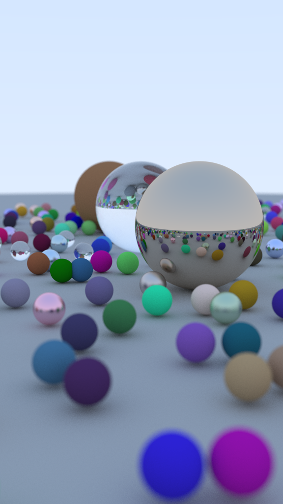

# YARR! - Native & Web-based Raytracer


### Pirate speak for ___"Yet Another Rust Raytracer"___

Ahoy, me fellow mateys! This project serves as my own personal journey with learning Rust. It also led me to cross-compiling to WebAssembly.

Building a raytracer is a great way to learn a modern language like Rust, where you can hone your skills in software design and performance-minded implementation. Rust is also well suited for systems programming, where close-to-the-metal control, performance, and data safety are critical to the craft.

I'm a C/C++ programmer at heart, yet my heart grows ever so fonder for Rust. Rust definitely gives C++ a run for its money.

- Based on Peter Shirley's great "Raytracing in One Weekend" book series
- Core implementation in Rust, with some JavaScript glue
- Builds natively for Windows, MacOS, Linux & Dub-dub-dub (JavaScript & WebAssembly)
- Multi-threaded via rayon crate, wasm-bind-rayon, and as well as a (manually) managed web worker pool
- Tested on iOS/Android via Chrome browser

## Get the source
```console
git clone https://github.com/KhoiFish/yarr.git
```

## Software pre-requisites

To build this project, you'll need to install the following software. *_Note: the following commands are assumed to be from the root directory of the project._*

#### Install rust
https://www.rust-lang.org/tools/install

#### Install npm
https://nodejs.org/en/download/

#### Install this version of nightly Rust (enables multi-thread support for WebAssembly)
```console
rustup component add rust-src --toolchain nightly-2021-07-29-x86_64-pc-windows-msvc
```

#### Install wasm-bindgen-cli to build wasm bindings:
```console
cargo install -f wasm-bindgen-cli
```

#### Install npm packages and dependencies for the web target:
```console
cd web
npm install
```

## Building
You can use the scripts provided in this repo to build and host a local web server, or use these commands directly:

#### Build natively on your machine:
```console
cargo build --release
```

#### Test natively on your machine. This will output a ppm image file (use GIMP to view):
```console
cargo run --release > output.ppm
```

#### Build web app:
```console
npm --prefix ./web run build
```

#### Host and try out WebAssembly locally:
```console
npm --prefix ./web run host
```

## Credits & Credits

#### Learn Raytracing
If you're new to raytracing, I highly recommend you take a weekend (or two) to go through Peter Shirley's [RayTracing in One Weekend](https://raytracing.github.io/books/RayTracingInOneWeekend.html) series of books. It's a great read and this project's raytracing core is based on it.

#### WebAssembly & Multi-threading on the Web
The following are great resources in learning how to setup Rust & WebAssembly for the web.

* [WASM bindings with wasm-bindgend](https://rustwasm.github.io/docs/wasm-bindgen/introduction.html)
* [Parallel demo with wasm-bindgen](https://github.com/rustwasm/wasm-bindgen/tree/main/examples/raytrace-parallel)
* [Drop-in wasm parallelism with wasm-bindgen-rayon](https://github.com/GoogleChromeLabs/wasm-bindgen-rayon)
* [Manage web worker communication with Comlink](https://github.com/GoogleChromeLabs/comlink)

## Special Thanks
I'd like to thank the following people:
* Peter Shirley, whose books really inspired me. As a kid, I always loved computer generated graphics, and his down-to-earth lessons made my childhood dream of writing a raytracer come true.
* Diep Mai, for his friendship, and for introducing me to Rust. I finally got around to learning how to Rust!

## License
This is free and open-source software distributed under the MIT License.
