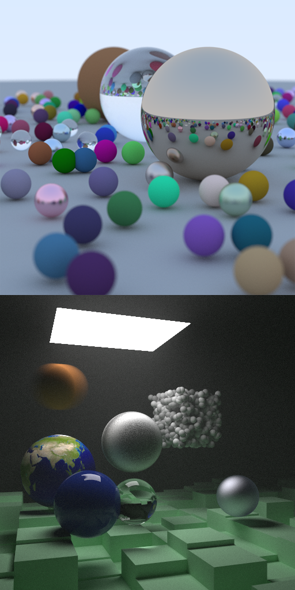

# YARR - a Native & Web-based Raytracer


### Pirate speak for ___"Yet Another Rust Raytracer"___

Ahoy, me fellow mateys! 

YARR is the result of my personal journey with learning Rust. It also led me to cross-compiling to WebAssembly along the way. 

Rust is well suited for systems programming, where close-to-the-metal control, performance, and data safety are crucial to the craft. Building a raytracer is a great way to learn a modern language like Rust; writing a raytracer using Rust can hone skills in software design, multi-threading/parallelism, and performance-minded implementation. 

I'm a C/C++ programmer at heart, yet my heart grows ever so fonder for Rust. **Rust gives C++ a run for its money.**

- Based on Peter Shirley's great "Raytracing in One Weekend" book series
- Core implementation in Rust, with some JavaScript glue for the web
- Builds natively for Windows, MacOS, Linux & dub-dub-dub (JavaScript & WebAssembly)
- Multi-threaded via rayon crate, wasm-bind-rayon, and as well as a manually managed web worker pool
- Tested on iOS/Android via Chrome browser

## Get the Source
```console
git clone https://github.com/KhoiFish/yarr.git
```

## Software Prerequisites

To build this project, you'll need to install the following software. 
_Note: the following commands are assumed to be from the root directory of the project._

### Install rust
https://www.rust-lang.org/tools/install

### Install npm
https://nodejs.org/en/download/

### Install nightly rust
Although this project includes a manually managed web worker pool implementation, the other mulit-threaded solution uses wasm-bindgen-rayon, which requires a build of the rust toolchain with atomics and shared memory enabled. Hopefully these features will be built as part of the standard stable release of Rust in the future.

#### Install toolchain
```console
cargo install
```

#### Install wasm-pack
This is needed to build wasm bindings from rust to JavaScript/Node.
```console
cargo install wasm-pack
```

##### If you're on Windows
You may run into a problem installing wasm-pack on Windows. Try downloading and installing manually from here if you do:
[Windows wasm-pack installer](https://rustwasm.github.io/wasm-pack/installer/)

#### Add toolchain sources
```console
rustup component add rust-src --toolchain nightly-2021-07-29
```

### Install npm packages
This downloads and installs the dependencies needed to build and locally host the web app.
```console
cd web
npm install
```

## How to Build
You can use the scripts provided in this repo to build and host a local web server, or use these commands directly:

### Build a native console app
This compiles to native code on your platform. Great for comparing perf between native vs web.
```console
cargo build --release
```

### Testing the native console app 
This outputs a file, output.png to the current directory. We pass in 'progress-ui' which enables a progress bar using the indicatif library.
```console
cargo run --release --features='progress-ui'
```

### Building the web app
This uses npm to kick off build and package it.
```console
npm --prefix ./web run build
```

### Hosting a local web server
Run this to try the WebAssembly app. The node-js serve app is configured to serve cross-origin headers, needed to run the multi-threaded implementation using wasm-bind-rayon.
```console
npm --prefix ./web run host
```

## References
### Learning rust
I recently joined the _Rust Gang_ by reading [Programming Rust: Fast, Safe Systems Development](https://www.amazon.com/Programming-Rust-Fast-Systems-Development/dp/1492052590). It introduces and deep-dives the Rust language from the perspective of systems development. It's also surprisingly fun to read with light and professional humor. If you are coming from another systems language such as C/C++, this is the book for you.

### Learning raytracing
If you're new to raytracing, I highly recommend you take a weekend (or two!) and go through Peter Shirley's [RayTracing in One Weekend](https://raytracing.github.io/books/RayTracingInOneWeekend.html) series of books. It's a great read and this project's raytracing core is based on it.

### WebAssembly & multi-threading on the web
The following are great resources in learning how to setup Rust & WebAssembly for the web.

* [Create wasm bindings with wasm-bindgen](https://rustwasm.github.io/docs/wasm-bindgen/introduction.html)
* [Parallel demo with wasm-bindgen](https://github.com/rustwasm/wasm-bindgen/tree/main/examples/raytrace-parallel)
* [Drop-in wasm parallelism with wasm-bindgen-rayon](https://github.com/GoogleChromeLabs/wasm-bindgen-rayon)
* [Manage web worker communication with Comlink](https://github.com/GoogleChromeLabs/comlink)

## Special Thanks
I'd like to thank the following people:
* Peter Shirley, whose books really inspired me. As a kid, I always loved computer generated graphics, and his down-to-earth lessons made my childhood dreams of writing my own raytracer come true.
* Diep Mai, for his friendship, and for introducing me to Rust. I finally got around to learning how-to-rust!

## License
This is free and open-source software distributed under the MIT License. Feel free to use this, and go get 'em tiger.
